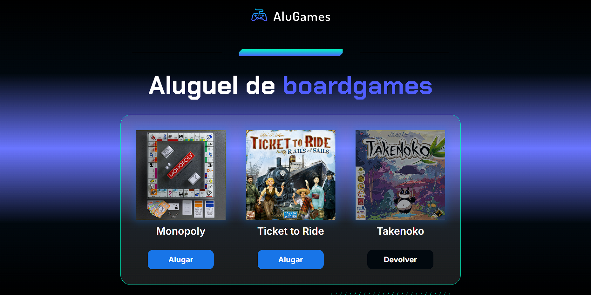

# 🎮 Alug Games

Uma página simples para **alugar/devolver jogos** com troca de estado no botão e efeitos visuais na capa. Projeto didático em **HTML, CSS e JavaScript**.

> ✅ Ideal para treinar DOM, classes CSS dinâmicas e organização de front-end estático.

---

## 🔗 Demo

👉 [Acesse aqui](https://andresvyeyra.github.io/alug-games/)

---

## ✨ Funcionalidades

- Alterna o estado do jogo entre **Alugar** ↔ **Devolver**.
- Aplica/remover **classes CSS** no botão e na capa do jogo.
- Estrutura de pastas organizada: `css/`, `js/`, `img/`, `index.html`.

---

## 🖼️ Preview



---

## 🧠 Como funciona

No arquivo `js/` há a função principal:

```js
function alterarStatus(id) {
  const game = document.getElementById(`game-${id}`);
  const statusGamerBotao = game.querySelector("a");
  const textoStatusGamer = statusGamerBotao.textContent;
  const capaGamer = game.querySelector("div");

  if (textoStatusGamer === "Alugar") {
    statusGamerBotao.textContent = "Devolver";
    statusGamerBotao.classList.add("dashboard__item__button--return");
    capaGamer.classList.add("dashboard__item__img--rented");
  } else {
    statusGamerBotao.textContent = "Alugar";
    statusGamerBotao.classList.remove("dashboard__item__button--return");
    capaGamer.classList.remove("dashboard__item__img--rented");
  }
}
```
